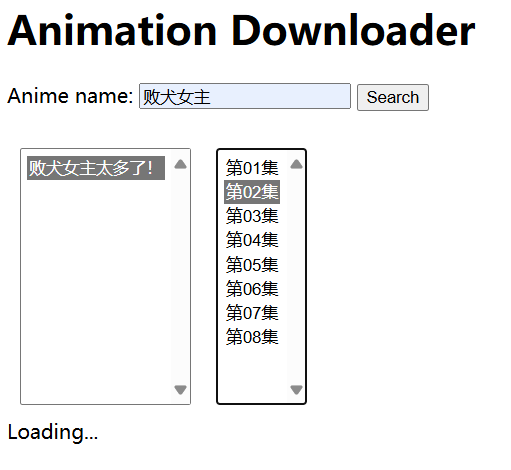

# 动画下载工具


### 你需要node.js来运行这个项目。你可以在这里下载[node.js](https://nodejs.org/)
## 如何使用
- 下载仓库到本地，安装依赖
```
cd path_to_your_project
git clone https://github.com/theamusing/AnimeDownloader.git
cd AnimeDownloader
npm install
```
- 运行服务器
```
node ./server.js
// 默认运行在3000端口上，你也可以自定义运行的端口
node ./server.js --port=3001
```
- 在浏览器中访问[localhost:3000](https://localhost:3000)
- 输入你想搜索的动画名称（例如：路人女主），选择对应的动画和集数
  
- 等待资源加载，一段时间后可以在下方窗口中看到动画播放。侧边栏会显示动画的实际下载地址和资源类型，其中
```
NORMAL: 普通视频文件
HLS: 流式传输视频，一般为一个m3u8文件
```
- 点击download即可下载动画。HLS资源需要等待所有切片下载完成并合并成mp4文件。

## 项目原理
- 资源列表通过AGE动漫网的Api获取。当短时间内多次访问时可能导致ip被暂时封锁，此时转而使用puppeteer进行虚拟网页请求，速度会慢一些。
- 本项目使用了本地服务器代理资源请求，绕过了浏览器的CORS限制。
- 对于m3u8格式视频，本项目会尝试下载所有ts切片并合并为一个mp4文件。合并mp4部分功能使用[muxjs](https://github.com/videojs/mux.js/)，但由于原始项目构建mp4文件时无法正确计算总时长，采用[此项目](https://github.com/Momo707577045/m3u8-downloader)的版本。详情见(https://github.com/videojs/mux.js/pull/354)
  
## 异常情况
- 加载视频资源时，项目会尝试寻找响应速度最快的资源，但可能出现所有资源都超时的情况。如果长时间无法加载资源，请点击retry。
- 部分m3u8视频资源使用jpeg作为切片，暂时无法处理这种情况。
- 本项目无法保证ts切片合并得到的mp4资源能够在本地播放器上正常播放。如果遇到这种情况，可以考虑使用更鲁棒的下载策略（例如第三方m3u8下载器）。下载链接在选集的右边栏给出。

## 免责声明
- 本项目仅供学习使用，别搞我

